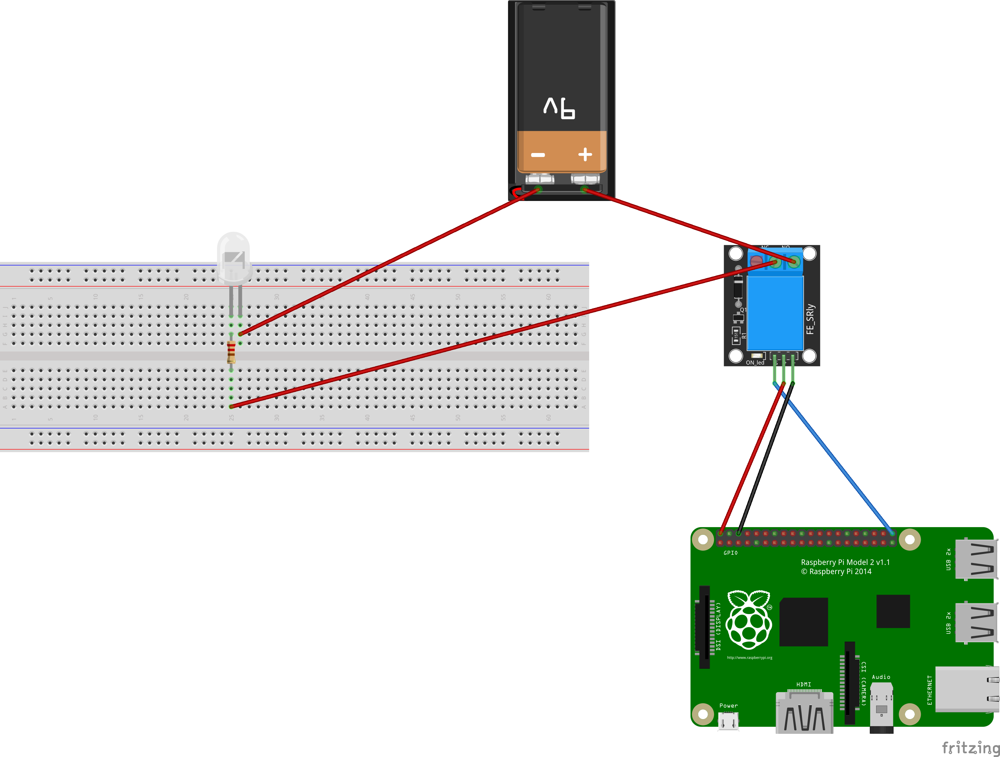

# workshop_relay_example
Material for raspberry pi workshop

# Wiring



|RELAY                | Raspberry pi                  |
|-------------------|---------------------------------|
|-                  | GND pin                         |
|+                  | +5v pin                         |
|Signal             | GPIO 21                         |

# Code

## 1- Power your raspberry

You can achive it with connecting it to your pc trought the Micro USB Port of the raspberry pi


## 2- Connect to your raspberry pi
Using putty if you're on windows, Ssh if you're on a linux based os
Follow the following instruction if you dont know how to connect to raspberry pi
[Connect to raspberry pi using Putty](https://github.com/ionoid-io-projects/workshop/blob/master/doc/od-iot-raspbian-rpi-zero-windows.md#5-first-boot)

## 3- Download relay binary file

Assuming you're connected with... copy and past this command
If you're using Raspberry zero
```
curl -O https://raw.githubusercontent.com/ionoid-io-projects/workshop_relay_example/master/bin/arm6/relay
```

If you're using Raspberry 3 b
```
curl -O https://raw.githubusercontent.com/ionoid-io-projects/workshop_relay_example/master/bin/arm7/relay
```
## make it executable
```
chmod +x relay
```

## 4- execute binary to make led blink
```
./relay
```

## How to stop the program
To quit or stop the program click on **Ctrl+C**

# Ressources


